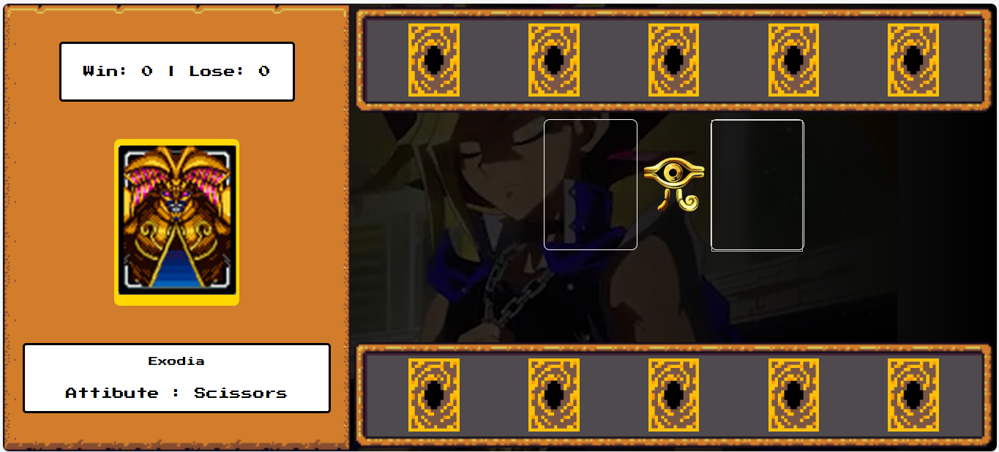

<div align="center">
  <h1>🃏 Yu-Gi-Oh! Duel Engine</h1>
  
  <p>
    Simulador de batalhas de cartas baseado em estados, implementando a lógica clássica de 
    "Jokenpô" (Rock-Paper-Scissors) com interface temática imersiva.
  </p>

  
  
  
  <br><br>

  <a href="https://ederjuniors.github.io/YuGiOh-Duel-JS/">
    
  </a>
</div>

<br>

<div align="center">
  
</div>

<br>

## 📋 Sobre o Projeto

Este projeto foi desenvolvido como parte do bootcamp **Ri Happy - Front-end do Zero (DIO)**. O desafio técnico consistiu em criar uma "Engine de Duelo" onde o jogador enfrenta a CPU.

O foco principal foi a manipulação avançada do DOM para atualizar o campo de batalha dinamicamente (Battlefield), gerenciamento de áudio (BGM e SFX) e lógica de comparação de atributos para determinar o estado de vitória, derrota ou empate.

## 🚀 Funcionalidades & Lógica

- **State Management:** Controle de placar (Scoreboard) e reset de partida sem recarregar a página.
- **Atributos Circulares:** Implementação da lógica onde *Papel vence Pedra*, *Pedra vence Tesoura* e *Tesoura vence Papel*, mapeados para os atributos das cartas (Exodia, Dark Magician, Blue Eyes).
- **Interatividade UI/UX:**
    - Efeitos de *Hover* e *Focus* nas cartas.
    - Atualização dinâmica de descrições e imagens no painel lateral.
- **Audio Context:** Reprodução de trilha sonora (BGM) controlada pelo usuário.

## 🛠️ Tecnologias Utilizadas

-  **Estrutura:** Layout semântico dividindo o campo em "Versus", "Player Hand" e "Computer Hand".
-  **Estilização:**
    - Uso de **Flexbox** para alinhamento do tabuleiro.
    - **Keyframes Animations** para efeitos visuais de batalha.
    - Cursor personalizado para imersão.
-  **Core Logic:**
    - **Object Oriented approach (Simulated):** Uso de objetos constantes para definir os atributos das cartas (`cardData`).
    - **Randomization:** Algoritmo `Math.random()` para a IA do computador.
    - **Event Listeners:** Captura de interação para seleção de cartas.

## 📂 Estrutura do Projeto

```bash
/
├── src/
│   ├── assets/
│   │   ├── audios/      # BGM e efeitos sonoros
│   │   ├── icons/       # Favicon e ícones de atributos
│   │   └── img/         # Sprites das cartas e cenário
│   ├── css/
│   │   └── main.css     # Estilização global e reset
│   └── js/
│       └── main.js      # Lógica da Engine de Duelo
├── index.html           # View Principal
└── README.md            # Documentação
```

## 🏁 Como Executar Localmente
Clone o repositório:

```bash
git clone https://github.com/EderJuniorS/YuGiOh-Duel-JS.git
```

Abra o arquivo index.html no seu navegador.

<div align="center"> Desenvolvido por <a href="https://www.linkedin.com/in/ederjuniormatossilva">Éder Junior</a> durante o Bootcamp DIO. </div>
